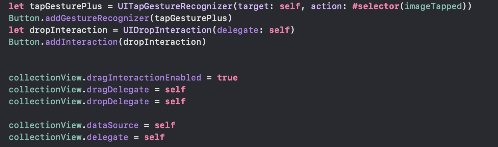

Learning Experience with UIKit and SwiftUI

# Introduction

This project is a recreation of [StickyNotes] by Hive5 Studios, an application available on the App Store. The purpose of this recreation is solely for learning and educational purposes during my Academic Year at Apple Developer Academy (2023/2024).

## Objective

The main objective of this project is to gain practical experience in iOS development by reverse engineering and rebuilding an existing app from the App Store. By dissecting the features, UI/UX design, and functionality of the original app, I aimed to deepen my understanding of iOS app development concepts and techniques.
In particular, the main goal of this repository is to explain which were the main struggles and discoveries I found in recreating an interesting app from the App Store in SwiftUI, and then in recreating it again in UIKit. 

## Learning Goals

1. Gain insights into implementing various features and functionalities found in the original app.
2. Improve proficiency in UIKit or SwiftUI (depending on the original app's technology stack) and related frameworks.
3. Practice app development best practices such as code organization, testing, and documentation.

## Disclaimer

**It's important to note that this recreated app is not intended for commercial use, distribution, or any form of profit.**

**The purpose of this project is purely educational, and it is not affiliated with the creators or developers of the original app in any way.**

# Learning Experience

The initial intention regarding this project was to develop it entirely in SwiftUI. Back in November 2023, I was not able to understand the real differences between UIKit and SwiftUI, and assuming that their potential use was identical, I chose to temporarily exclude UIKit for the beginning part of my journey in iOS development.

What attracted me the most about this project was to increase my knowledge focusing on both gestures, data persistency, and runtime view updating working on just two screens. The amount of topics I needed to focus on was huge, but for the sake of consistency and to avoid excessive elaboration, in the next sections, I will focus on three of them only:

- Drag and Drop interactions;
- Navigation;
- Data persistency.

As of March 2024, I had clearer clues about overall iOS development, and I decided to port my previous acquisitions about SwiftUI to UIKit too.

## Navigation
The first topic I had to struggle with in managing UIKit was navigating from the MainView to the DetailView of the Notes. 

## Data Persistency

## Drag and Drop

### 2. Transitioning to UIKit

### 3. Challenges Encountered

### 4. Lessons Learned
Flexibility vs. Simplicity: 

### 5. Conclusion

