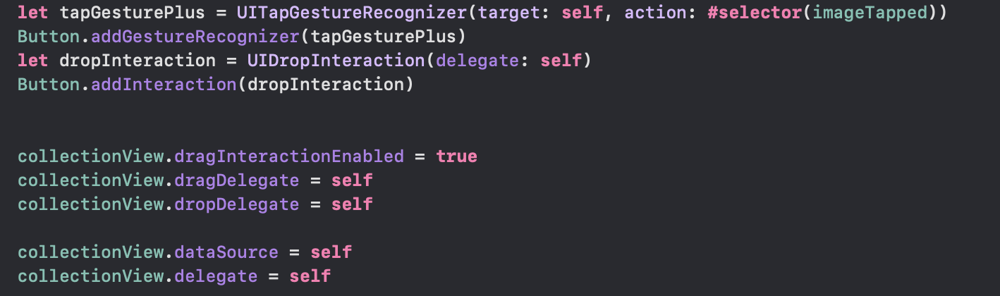
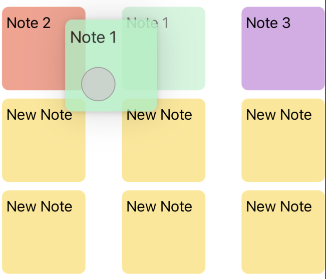

Learning Experience with UIKit and SwiftUI

# Introduction

This project is a recreation of [StickyNotes] by Hive5 Studios, an application available on the App Store. The purpose of this recreation is solely educational.

## Objective

The main objective of this project is to gain practical experience in iOS development by reverse engineering and rebuilding an existing app from the App Store. By dissecting the features, UI/UX design, and functionality of the original app, I aimed to deepen my understanding of iOS app development concepts and techniques.
In particular, the main goal of this repository is to explain which were the main struggles and discoveries I found in recreating an interesting app from the App Store in SwiftUI, and then in recreating it again in UIKit. 

## Learning Goals

1. Gain insights into implementing various features and functionalities found in the original app.
2. Improve proficiency in UIKit or SwiftUI (depending on the original app's technology stack) and related frameworks.
3. Practice app development best practices such as code organization, testing, and documentation.

## Disclaimer

**It's important to note that this recreated app is not intended for commercial use, distribution, or any form of profit.**

**The purpose of this project is purely educational, and it is not affiliated with the creators or developers of the original app in any way.**

# Learning Experience

The initial intention regarding this project was to develop it entirely in SwiftUI. Back in November 2023, I was not able to understand the real differences between UIKit and SwiftUI, and assuming that their potential use was identical, I chose to temporarily exclude UIKit for the beginning part of my journey in iOS development.

What attracted me the most about this project was to increase my knowledge focusing on both gestures, data persistency, and runtime view updating working on just two screens. The amount of topics I needed to focus on was huge, but for the sake of consistency and to avoid excessive elaboration, in the next sections, I will focus on three of them only:

- Drag and Drop interactions;
- Navigation;

As of March 2024, I had clearer clues about overall iOS development, and I decided to port my previous acquisitions about SwiftUI to UIKit too.

## Navigation
The first topic I had to struggle with in managing UIKit was navigating from the MainView to the DetailView of the Notes. 
In SwiftUI, every navigation was made possible by the use of NavigationLinks, placed in proper Navigation Stacks.

Approaching UIKit I discovered the existence of Storyboards, and with them the concept of "Segue".
Connecting elements in the interface, you can define the navigation flow of the whole app simply connecting elements and views. After that, you can programmatically decide in which conditions the transition between views, named Segue, must be performed. Furthermore, you can setup the variables and the elements of your code to prepare for the transition.

## Data Persistency

## Drag and Drop
This was the hardest part of the journey. The reason why everything started, and the most difficult obstacle to overcome. 
There are different ways to manage Drag&Drop features in both UIKit and SwiftUI.

DragGesture:

DragGesture is used to detect dragging gestures in SwiftUI views. It allows you to track the movement of the user's finger and perform actions based on that movement.
You can attach a DragGesture to any SwiftUI view using the .gesture modifier. It provides callbacks for handling the start, changes, and end of the drag gesture.

.draggable:

.draggable is a modifier in SwiftUI used to make views draggable by adding a drag gesture to them.
Usage: You apply the .draggable modifier to a SwiftUI view to enable dragging behavior. This modifier internally uses DragGesture to track the drag gesture and update the position of the view accordingly.

### 2. Transitioning to UIKit

UIPanGestureRecognizer:

Part of UIKit.
UIPanGestureRecognizer is a gesture recognizer provided by UIKit for detecting and tracking the movement of a touch.
Usage: In UIKit, you create and configure a UIPanGestureRecognizer instance and attach it to a view using the addGestureRecognizer(_:) method. You then implement delegate methods or add target-action methods to respond to the pan gesture.

After all of that, I discovered for my specific needs the existence of UICollectionViewDragDelegate, and its complementary part UICollectionViewDropDelegate.
Defining a View Controller as Delegate, it provides you a set of methods to manage the result of Drag&Drop operations specifically on Collection View cells.

